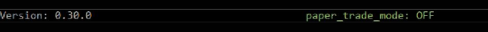

import Callout from "../../src/components/Callout";
import StatusCircle from "../../src/components/StatusCircle";

This feature allows users to test Hummingbot and simulate trading strategies without risking any actual assets. Enter the command `paper_trade` to enable this feature.


<Callout
  type="note"
  body="Exchange APIs are not required to run the bot on paper_trade for Pure Market making, Cross Market Making and Liquidity Mining strategies. "
/>

## Enabling and Disabling

Paper trading mode can be enabled and disabled from the Hummingbot client by doing `paper_trade` or `config paper_trade_enabled`.

The top bar shows the status to indicate if paper trading mode is on or off.



Also shows a reminder that paper trade was enabled when doing a `status` or `history` command.


<Callout
type="tip"
body="In the event that the bot is running on paper trade and you disable it, you need to `stop` and `start` the bot to apply the changes. Make sure your Exchange APIs are connected as well when going live."
/>

## Adding Paper Trade Balance

By default, the paper trade account has the following tokens and balances which you can see when you run the `balance paper` command.

```
>>>  balance paper
Paper account balances:
    Asset    Balance
      DAI  1000.0000
      ETH    10.0000
      ONE  1000.0000
     TUSD  1000.0000
     USDC  1000.0000
     USDQ  1000.0000
     USDT  1000.0000
     WETH    10.0000
      ZRX  1000.0000
```

When adding balances, specify the asset and balance you want by runing this command `balance paper [asset] [amount]`.

For example, we want to add 0.5 BTC and check our paper account balance to confirm.

```
>>>  balance paper BTC 0.5
Paper balance for BTC token set to 0.5

>>>  balance paper
Paper account balances:
    Asset    Balance
      BTC     0.5000
      DAI  1000.0000
      ETH    10.0000
      ONE  1000.0000
     TUSD  1000.0000
     USDC  1000.0000
     USDQ  1000.0000
     USDT  1000.0000
     WETH    10.0000
      ZRX  1000.0000
```

Here is the list of our Supported Connectors that could run `paper_trade` as of version 0.37.1.

| Connector                                               |                   Status                   | Description                                                                                                                                                                             |
| :------------------------------------------------------ | :----------------------------------------: | :-------------------------------------------------------------------------------------------------------------------------------------------------------------------------------------- |
| [Beaxy](/exchange-connectors/beaxy)                     | <StatusCircle color="yellow" font="25px"/> | Connector is new (BETA) and may have some undiscovered issues                                                                                                                           |
| [Binance](/exchange-connectors/binance)                 | <StatusCircle color="green" font="25px"/>  | Connector is working properly and safe to use                                                                                                                                           |
| [Binance US](/exchange-connectors/binance-us)           | <StatusCircle color="yellow" font="25px"/> | Connector has one or more reported issues. Refer to our [Github page](https://github.com/CoinAlpha/hummingbot/issues?q=is%3Aopen+%22binance+US%22+in%3Atitle) page for more information |
| [Bitfinex](/exchange-connectors/bitfinex)               | <StatusCircle color="yellow" font="25px"/> | Connector has one or more reported issues. Refer to our [Github page](https://github.com/CoinAlpha/hummingbot/issues?q=is%3Aopen+%22bitfinex%22+in%3Atitle) page for more information   |
| [Bitmax](/exchange-connectors/Bitmax)                   | <StatusCircle color="green" font="25px"/>  | Connector is working properly and safe to use                                                                                                                                           |
| [Bittrex Global](/exchange-connectors/bittrex)          | <StatusCircle color="yellow" font="25px"/> | Connector has one or more reported issues. Refer to our [Github page](https://github.com/CoinAlpha/hummingbot/issues?q=is%3Aopen+%22bittrex%22+in%3Atitle) page for more information    |
| [Coinbase Pro](/exchange-connectors/coinbase)           | <StatusCircle color="green" font="25px"/>  | Connector is working properly and safe to use                                                                                                                                           |
| [Crypto.com](/exchange-connectors/crypto-com)           | <StatusCircle color="yellow" font="25px"/> | Connector has one or more reported issues. Refer to our [Github page](https://github.com/CoinAlpha/hummingbot/issues?q=is%3Aopen+%22crypto.com%22+in%3Atitle) page for more information |
| [dYdX](/exchange-connectors/dydx)                       | <StatusCircle color="green" font="25px"/>  | Connector is working properly and safe to use                                                                                                                                           |
| [Huobi Global](/exchange-connectors/huobi)              | <StatusCircle color="green" font="25px"/>  | Connector is working properly and safe to use                                                                                                                                           |
| [Kraken](/exchange-connectors/kraken)                   | <StatusCircle color="green" font="25px"/>  | Connector is working properly and safe to use                                                                                                                                           |
| [KuCoin](/exchange-connectors/kucoin)                   | <StatusCircle color="green" font="25px"/>  | Connector is working properly and safe to use                                                                                                                                           |
| [Liquid](/exchange-connectors/liquid)                   | <StatusCircle color="green" font="25px"/>  | Connector is working properly and safe to use                                                                                                                                           |
| [OKEx](/exchange-connectors/okex)                       | <StatusCircle color="green" font="25px"/>  | Connector is working properly and safe to use                                                                                                                                           |
| [ProBit Global](/exchange-connectors/probit)            | <StatusCircle color="yellow" font="25px"/> | Connector is new (BETA) and may have some undiscovered issues                                                                                                                           |

<Callout
  type="note"
  body="Spot exchanges that are not listed are currently broken and unusable"
/>
