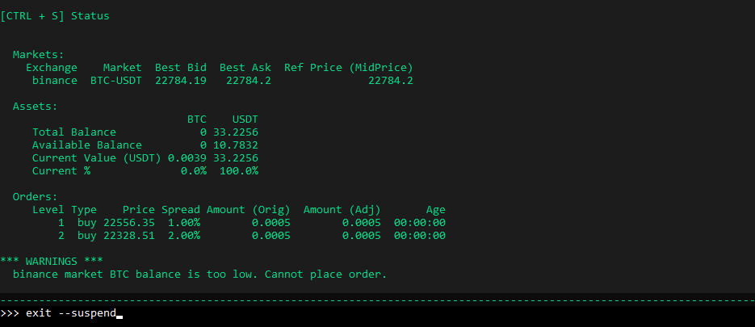
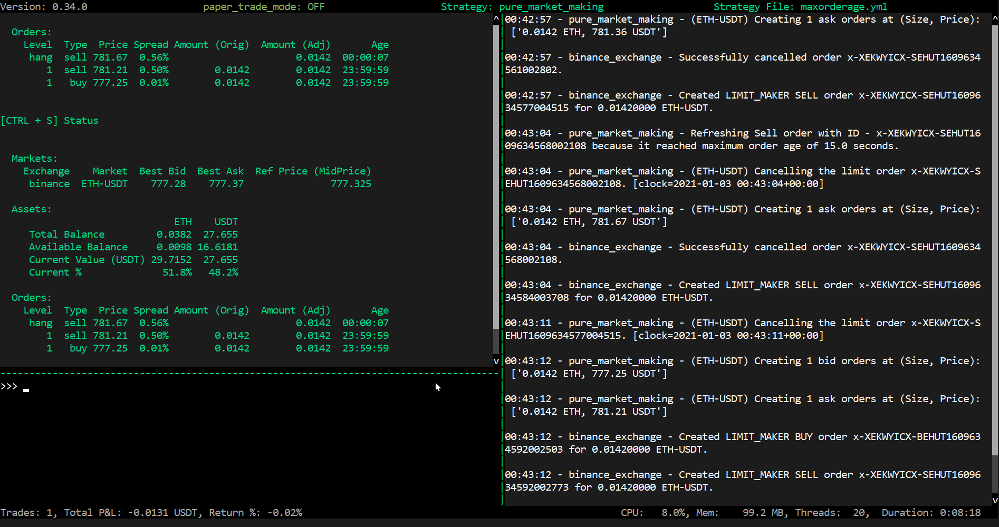

This feature allows users to pause a running strategy using the command `exit --suspend`. This allows the bot to stop while keeping the hanging orders in the order book. To resume, run the command `start --restore`.

## Pause

The `exit --suspend` command will exit the hummingbot client but leave the orders hanging and hanging orders will remain as hanging orders.

This could be an advantage if you don’t want to cancel orders but want to exit the bot.

## Resume

The `start --restore` command will start the strategy `config` and restore the last sets of orders and hanging orders as well.

> Note: After running `start --restore` spreads may change once the bot brings back your orders, it will display what the current spreads of your order.

You can see that when we use `exit --suspend` it exits the bot. When you run `start --resume` the hanging orders remained as hanging and the order that was not filled became a hanging order. Refer to the example below

