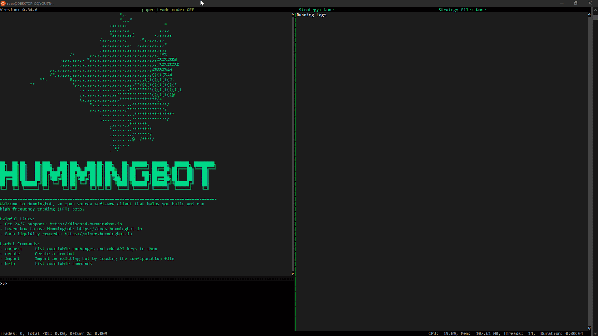
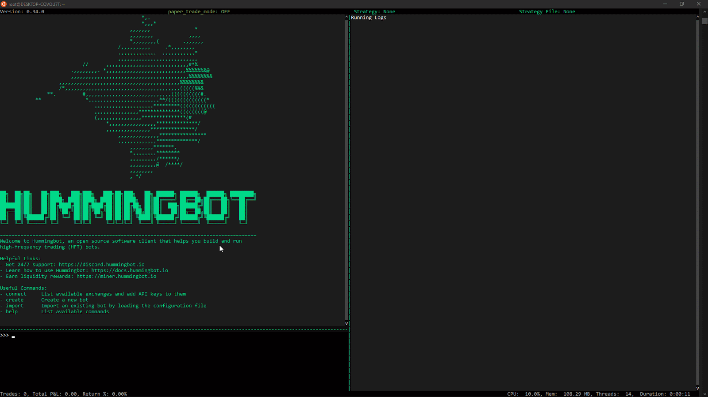

This feature allows users to pause a running strategy using the command `exit --suspend`. This allows the bot to stop while keeping the hanging orders in the order book. To resume, run the command `start --restore`.

## Pause

The `exit --suspend` command will exit the hummingbot client but leave the orders hanging and hanging orders will remain as hanging orders.

This could be an advantage if you don’t want to cancel orders but want to exit the bot.

### How to Pause

If you have existing strategy `config` file and want to use the pause feature you have to `import [strategy.yml]` then `start`, After running and you want to exit the bot but want to retain the orders created you have to run the `exit --suspend` command.

## Resume

The `start --restore` command will start the strategy `config` and restore the last sets of orders and hanging orders as well.

> Note: After running `start --restore` spreads may change once the bot brings back your orders, it will display what the current spreads of your order. 

### How to Resume

If you want to resume the bot that’s paused `exit --suspend` you have to import `import [strategy.yml]` then run `start --restore` to restore the last sets of orders and it will be tagged as hanging orders.

