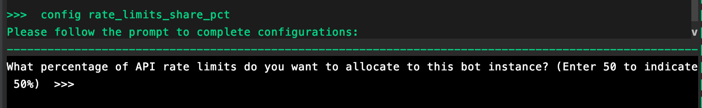
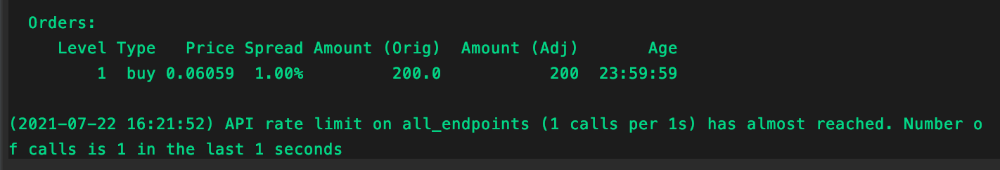

import Callout from "../../src/components/Callout";

Some exchanges impose rate limits per account. When running multiple bots using a single account, `rate_limits_share_pct` lets users set a rate limit percentage from the total limit to each instance. When the bot reaches the rate treshold, Hummingbot client sends a warning notification to users for them to adjust their configuration, as accounts can be banned when they exceed the limit.

For example, the rate limit for AscendEX is 100 requests per second. Your account will be banned for a certain period of time if you keep hitting the rate limit in 10 minutes (status code `429` or `100014`).

Setting the `rate_limits_share_pct` to 50% will configure the bot to notify the users when it starts to send 50 requests per second.

## How to use the parameter

1. Run `config rate_limits_share_pct` before starting a strategy
2. Enter the percentage of API rate limit you want to allocate to the bot
   
3. Start a strategy using `start` command
4. A notification will be displayed in the output pane when the `rate_limits_share_pct` value is about to be reached
   

<Callout
  type="note"
  body="You can also configure `rate_limits_share_pct` while the strategy is running but changes will take effect after restarting the strategy."
/>
