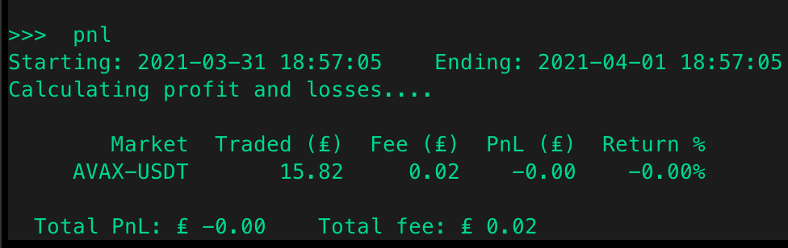

import Callout from "../../src/components/Callout";

import Prompt from "../../src/components/Prompt";

The feature rate oracle conversion is used to convert any fiat or to other token or coin that you want to display. It pulls data from sources then converts your token to the desired currency.

<Callout
  type="note"
  body="The implementation of the conversion only is used [cross exhange market making] and [arbitrage] strategy."
  link={["/strategies/cross-exchange-market-making/", "/strategies/arbitrage/"]}
/>

## `rate_oracle_source`

The source in where you want to pull data from it can either be Binance or Coingecko. Take note that using Coingecko will have a 30 second delay due to their API rate limit.

** Prompt: **

<Prompt
  prompt="What source do you want rate oracle to pull data from? (binance, coingecko)"
  response=">>> "
/>

## `global_token`

Global token you want to be displayed and converted currency to show.

** Prompt: **

<Prompt
  prompt="What is your default display token? (e.g. USDT,USD,EUR)"
  response=">>> "
/>

## `global_token_symbol`

Choose the symbol of the global token selected.

** Prompt: **

<Prompt
  prompt="What is your default display token symbol? (e.g. $, €)"
  response=">>> "
/>

## How it works

For the rate oracle conversion to show after the `balance`, `pnl`, `open_orders`, `trades`, and `status` command, You have to edit in `config_global.yml` to change the `rate_oracle_source`, `global_token` and `global_token_symbol` or you can edit it by using the `config` command.

Refer to the example below:

Changed the default setting in `conf_global.yml` to GBP (Great Britain Pound). The conversion will show up when you run `balance` command.

The conversion also shows up during the `status` command for the `liquidity_mining` strategy. Under the `Miner` section.

The conversion shows up when using the `pnl` command.

The conversion also shows up when running the `trades` command.

The conversion also works with the `open_orders` command.

