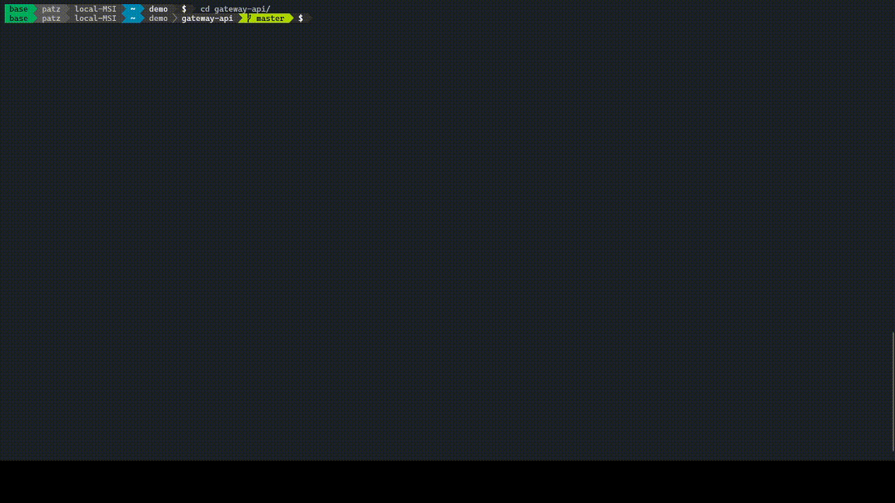
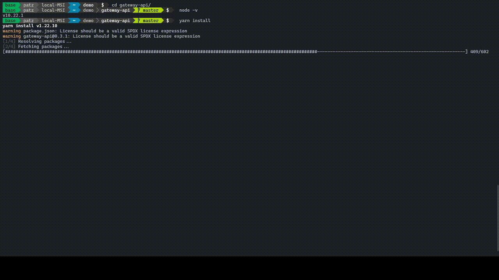
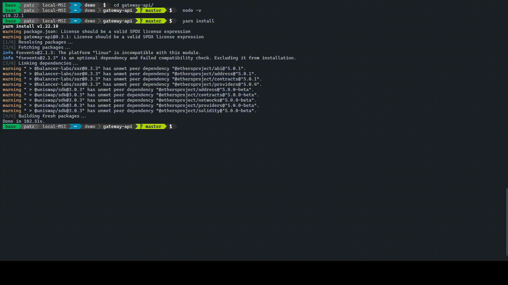
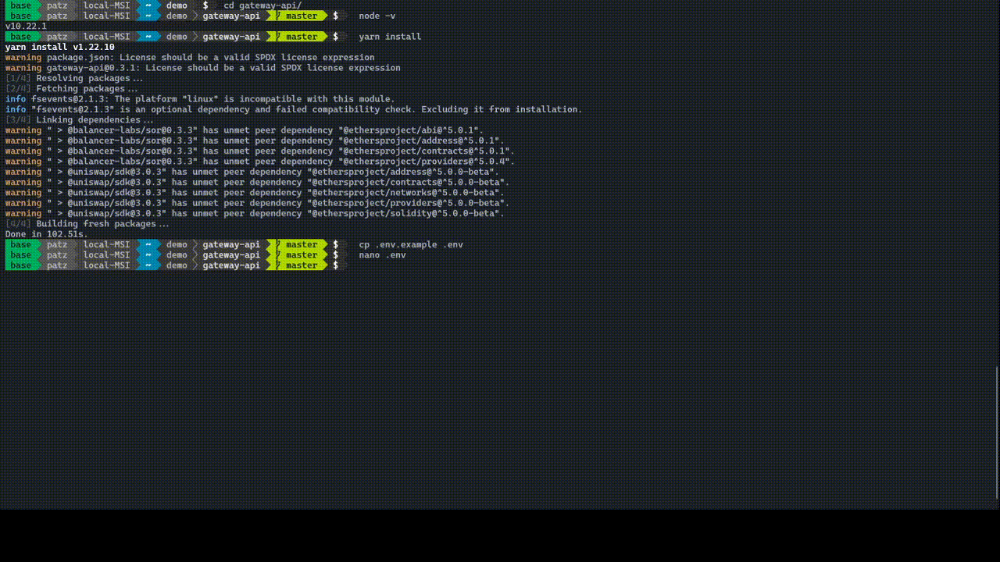

import Callout from "../../src/components/Callout";

## What is Hummingbot Gateway?

Gateway is a API server that allows Hummingbot to connect to [protocols](/protocol-connectors/overview/) that are used in the [amm-arb strategy](/strategies/amm-arb/) and other future strategies.


<Callout
  type="tip"
  body="It is best to use Hummingbot docker build when using Gateway, you can check [here] for installation."
  link={["/installation/windows/#install-via-docker"]}
/>

## Create SSL Certificates

1. Run the command `generate_certs` in the Hummingbot client
2. Enter a passphrase to be used later during installation


<Callout
  type="note"
  body="It's not recommended to use the same password as the Hummingbot instance."
/>

## Install Gateway via Docker

<Callout
  type="note"
  body="Only use gateway installation thru docker when using hummingbot docker build."
/>

1. Take note of the absolute path where your Hummingbot files are stored. You can run the command `pwd` from the terminal while inside the folder.
2. Copy and paste the following commands to your terminal:

### Mac

```Mac
curl https://raw.githubusercontent.com/CoinAlpha/hummingbot/development/installation/docker-commands/create-gateway.sh -o create-gateway.sh
curl https://raw.githubusercontent.com/CoinAlpha/hummingbot/development/installation/docker-commands/update-gateway.sh -o update-gateway.sh
chmod a+x *.sh
./create-gateway.sh
```

### Linux

```Linux
wget https://raw.githubusercontent.com/CoinAlpha/hummingbot/development/installation/docker-commands/create-gateway.sh
wget https://raw.githubusercontent.com/CoinAlpha/hummingbot/development/installation/docker-commands/update-gateway.sh
chmod a+x *.sh
./create-gateway.sh
```

It downloads the scripts from GitHub, sets their correct permission and runs the `create-gateway` script.

3. Answer each prompt, review the summary and enter **Y** to proceed with the installation.


<Callout
  type="note"
  body="When creating a Gateway instance for Ethereum protocol connectors such as [Balancer] and [Uniswap], the script picks up the settings from your global config file (`conf_global.yml`). Make sure to connect them first from the Hummingbot client before installing Gateway."
  link={["/protocol-connectors/balancer", "/protocol-connectors/uniswap"]}
/>

By default, Gateway will install on port `5000` which Hummingbot will connect to. If the default port is not available, Gateway will find the next port number.

4. The file `gateway.env` is created where your Gateway settings are saved.

## Configure Port Number (Optional)

In case the port number used by Gateway is not set to the default value of `5000`, make sure to set the `gateway_api_port` in the Hummingbot client to match the same port number.


1. Run command `config gateway_api_port` in the Hummingbot client
2. Enter the port number indicated when Gateway was created


## Update Gateway via Docker

To update the docker container, run the `update-gateway.sh` script and and follow the prompt instructions. The update script allows you to stop and delete the running instance, and update the docker image if it is not the latest. Upon completion, it will automatically execute the create-gateway.sh script to create a new Gateway container instance.

## Install Gateway via source

<Callout
  type="note"
  body="Only use gateway installation thru source when using hummingbot source build."
/>

### Prerequisites

Installation applies to Windows, Linux or macOS

1. NodeJS - visit this [page](https://docs.npmjs.com/downloading-and-installing-node-js-and-npm/) to download and install.

- Tested versions `v10.22.0, v10.22.1 and v10.23.1`.

```bash
# to check your current version
node -v
```



<Callout
  type="tip"
  body="You can install [nvm] to manage and use different node versions on the same system."
  link={["https://gist.github.com/d2s/372b5943bce17b964a79"]}
/>

2. Yarn - its required for node package installations.

```bash
# to install yarn
npm install yarn
```

- Tested versions `v1.22.5 and v1.22.10`

### Setup

Steps for setting up gateway-api

```bash
# clone the repo
git clone https://github.com/CoinAlpha/gateway-api
```

```bash
# open directory
cd gateway-api
```

```bash
# install npm packages
yarn install
```



```bash
# copy sample environment
cp .env.example .env
```



- Edit `.env` file with your favorite text editor then save changes.
- There are 3 ways to start the gateway

```bash
# run dev mode with hot reload on code changes
yarn run dev
```

```bash
# run debug mode with additional route debug logging
yarn run debug
```

```bash
# run prod mode
yarn run start
```


