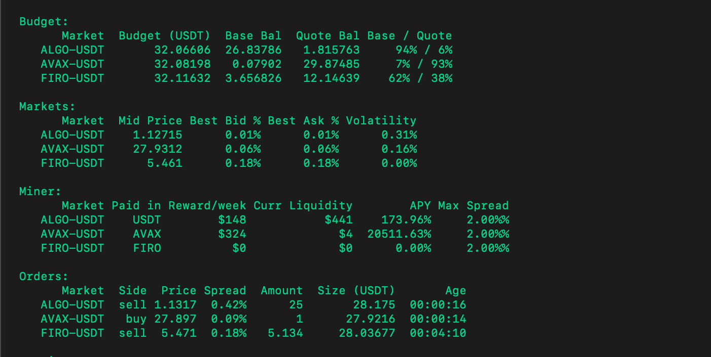

import Callout from "../../src/components/Callout";

_Released on February 08, 2021_

- **Download Installer**: [Windows](https://dist.hummingbot.io/hummingbot_v0.37.0_setup.exe) | [macOS](https://dist.hummingbot.io/hummingbot_v0.37.0.dmg)
- **Install via Docker**: [Linux](/installation/linux/#install-via-docker) | [Windows](/installation/windows/#install-via-docker) | [macOS](/installation/mac/#install-via-docker)| [Raspberry Pi](/installation/raspberry/)

---

## New Exchange Connector: ProBit

In this release, Hummingbot has added more exchanges and is planning to add a lot more exchanges this year! Hummingbot now supports [Probit](https://www.probit.com/) connector. Probit Exchange describes itself as a global coin-to-coin cryptocurrency exchange. ProBit Exchange only lists what it deems to be 'qualified and deserving' cryptocurrency projects. ProBit Exchange reportedly has an order matching speed of over 1.5 million orders per second and a customizable user interface. In addition, ProBit Exchange claims to provide users with the option of a hardware security key in addition to 2 Factor Authentication.

ProBit is compatible with [pure market making](https://docs.hummingbot.io/strategies/pure-market-making/), [cross-exchange market-making](/strategies/cross-exchange-market-making/), and [arbitrage strategies](/strategies/arbitrage/).

Read more about how to use the ProBit connector [here](/exchange-connectors/probit).

## New Exchange Connector: Beaxy

We are glad to present to you that Hummingbot now supports [Beaxy](https://beaxy.com/) exchange! Beaxy is a digital asset exchange that aims to set itself apart from others in the field by offering a feature rich platform built from the ground up with clients of every experience level in mind.

Beaxy is compatible with [pure market making](https://docs.hummingbot.io/strategies/pure-market-making/), [cross-exchange market-making](/strategies/cross-exchange-market-making/), and [arbitrage strategies](/strategies/arbitrage/).

Read more about how to use the Beaxy connector [here](/exchange-connectors/Beaxy).

## New Protocol Connector: Perpetual Finance

In v0.37, Hummingbot has added a new protocol connector, [Perpetual Finance](https://perp.fi/).

Perpetual protocol is a decentralized protocol to trade perpetual contracts for every asset powered by a Virtual Automated Market Maker (vAMM). The project aims to create novel financial instruments by democratizing Futures and other crypto-asset derivatives.

Read more about how to use the Perpetual Finance connector [here](/protocol-connectors/perp-fi)

## Introducing the new Spot Perpetual Arbitrage strategy (Beta)

In v0.37, we introduce the new Spot Perpetual Arbitrage strategy! This strategy lets you arbitrage between a spot and futures exchange. The differences between the prices on the spot and futures markets before the settlement date give a good sense of the direction in which both markets would go. Prices on both futures and spot will converge as the settlement date or time approaches.

The idea of this strategy is to open a position in one direction and execute an order in the opposite direction on the spot.

## Improvement to Liquidity Mining strategy

In v0.37, two new parameters has been added [`max_spread`](/strategies/liquidity-mining/#max_spread) and [`max_order_age`](/strategies/liquidity-mining/#max_order_age). Tables are also added to let you see more into detail about your balance and also the campaign you've selected.

## Bug Fixes

- #[2959](https://github.com/CoinAlpha/hummingbot/pull/2959) Pause and Resume fixed for Liquidity Mining strategy
- #[2997](https://github.com/CoinAlpha/hummingbot/pull/2997) Added VAI trading pair
- #[2999](https://github.com/CoinAlpha/hummingbot/pull/2999) Fix orders cancelling in a loop in Cross Exchange Market Making when using `paper_trade`
- #[3000](https://github.com/CoinAlpha/hummingbot/pull/3000) Fix orders cancelling in a loop when balance is too low when using `paper_trade`
- #[3002](https://github.com/CoinAlpha/hummingbot/pull/3002) Fix invalid orders that are being tracked by the bot
